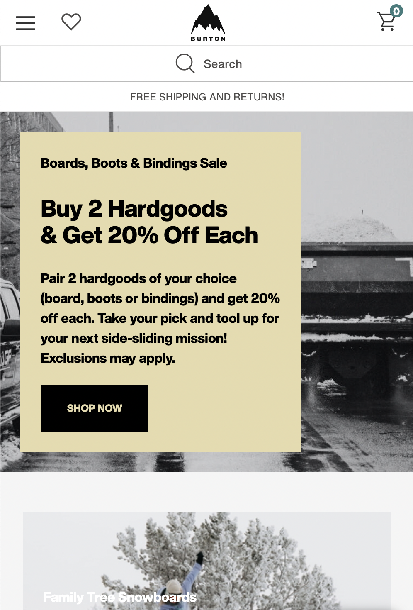
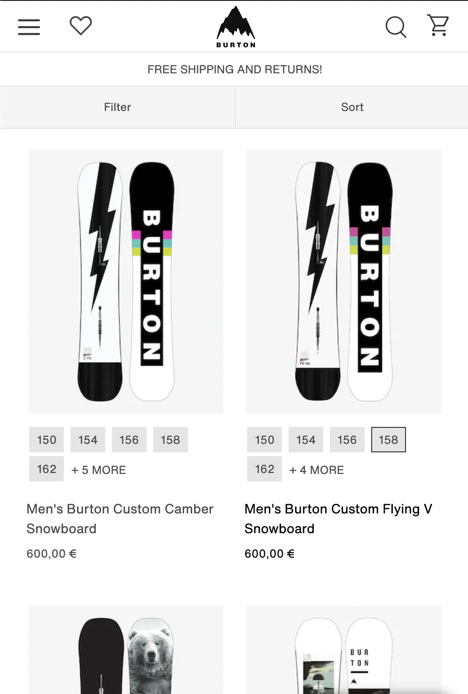

# Procesverslag
**Auteur:** Rowan Horn

Markdown cheat cheet: [Hulp bij het schrijven van Markdown](https://github.com/adam-p/markdown-here/wiki/Markdown-Cheatsheet). Nb. de standaardstructuur en de spartaanse opmaak zijn helemaal prima. Het gaat om de inhoud van je procesverslag. Besteedt de tijd voor pracht en praal aan je website.

## Bronnenlijst
1. https://www.burton.com/nl/en/home
2. https://www.bitdegree.org/learn/css-form
3. https://developer.mozilla.org/en-US/docs/Web/CSS/:nth-child
4. https://css-tricks.com/snippets/css/a-guide-to-flexbox/
5. https://www.w3schools.com/tags/ref_pxtoemconversion.asp
6. https://dev.to/devggaurav/let-s-build-a-responsive-navbar-and-hamburger-menu-using-html-css-and-javascript-4gci
7. https://codepen.io/om-10/pen/abvvBxR
8. https://developer.mozilla.org/en-US/docs/Web/CSS/Media_Queries/Using_media_queries
9. https://www.tutorialrepublic.com/faq/how-to-auto-resize-an-image-to-fit-into-a-div-container-using-css.php#:~:text=Answer%3A%20Use%20the%20CSS%20max,while%20maintaining%20its%20aspect%20ratio.
10. https://www.w3schools.com/howto/tryit.asp?filename=tryhow_css_social_media_buttons2
11. https://fontawesome.com/icons?d=gallery&p=2
12. https://www.w3schools.com/cssref/css3_pr_mediaquery.asp

## Eindgesprek (week 7/8)

-dit ging goed & dit was lastig-
goed:

lastig:
nav bar en footer responsive maken

**Screenshot(s):**

-screenshot(s) van je eindresultaat-

## Voortgang 3 (week 6)

-same as voortgang 1-

## Voortgang 2 (week 5)

-same as voortgang 1-

## Voortgang 1 (week 3)

### Stand van zaken

-dit ging goed & dit was lastig-

**Screenshot(s):**

-screenshot(s) van hoe ver je bent met korte uitleg-

### Agenda voor meeting

-samen met je groepje opstellen-

| student 1      | student 2          | student 3    | student 4        |
| ---            | ---                | ---          | ---              |
| dit bespreken  | en dit             | en ik dit    | en dan ik dat    |
| an dat ook nog | dit als er tijd is | nog een punt | dit wil ik zeker |
| ...            | ...                | ...          | ...              |

### Verslag van meeting

-na afloop snel uitkomsten vastleggen-

## Breakdownschets (week 1)
-uitwerken voor de 1e werkgroep - eind van de eerste week-

## Intake (week 1)
-uitwerken voor de kick-off werkgroep - begin van de eerste week-

**Je startniveau:** 
Blauwe piste🏂

**Je focus:** 
Responsive (wellicht beide)

**Je opdracht:** 
https://www.burton.com/nl/en/home
https://github.com/rowanhorn1412/front-end.git

**Screenshot(s) van de eerste pagina (small screen):**

**Screenshot(s) van de tweede pagina (small screen):**

