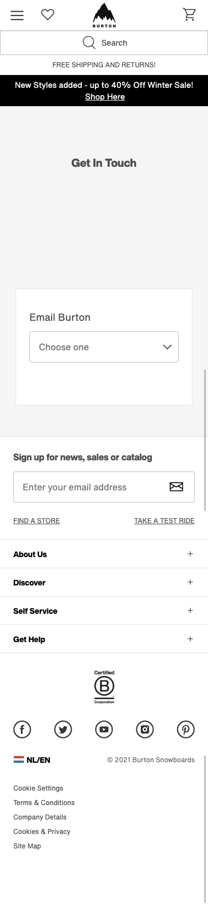

# Procesverslag
**Auteur:** Rowan Horn

## Week 1 Breakdownschets
zie einde Readme

**Je startniveau:** 
Had in eerste instantie het niveau op rode piste gezet, aangezien ik dacht dat ik wel goed overweg kon met html css en Js. Achteraf bleek dat css toch wat lastiger was dan ik dacht. Dit kwam voornamelijk omdat ik het al een lange tijd niet meer gedaan had.

**Je focus:** 
Responsive (wellicht beide)

**Je opdracht:** 
https://www.burton.com/nl/en/home

https://github.com/rowanhorn1412/front-end.git

Als opdracht heb ik gekozen om de website van Burton.com na te maken. 
De intake les was ik nog niet begonnen aan de website zelf, wel had ik al de breakdownschetsen klaar.

## week 2
Begonnen aan de html en css van de eerste pagina, veel gekeken naar de burton website zelf hoe die precies in elkaar zit.

Ik had een kleine fout gemaakt door meteen te beginnen met de css waardoor ik snel het overzicht kwijt raakte en niet meer goed door kon werken.

hierdoor begon ik meteen classes te geven aan html elementen. ook overbodig veel.

zoals bijvoorbeeld:
```html
<nav class="navigation navigation-top">
</nav>
```


Begonnen aan de flexbox, zie meteen al dat ik hier theorie moet bij leren aangezien er veel aan gedaan kan worden.
[Flexbox spiekbriefje (css-tricks)](https://css-tricks.com/snippets/css/a-guide-to-flexbox/)

Vind het nog lastig om te bepalen welke elementen nou welke flex tags krijgen, en welke niet.


## week 3 & 4
Na het gesprek ben ik er ook achter gekomen dat ik eerst moet beginnen met mobile first. Aangezien ik dit niet gedaan heb ik besloten om mijn hele css "tijdelijk" te verwijderen. hierdoor kan ik rustig opbouwen met html zodat er een goede structuur in de website zit. nadat ik alle html goed had neergezet ben ik eerst alle elementen border of kleuren gaan geven zodat ik een tijdelijk overzicht had van de positioneringen van de elementen.

dit heeft mij geholpen om beter inzicht te krijgen hoe de elementen op de pagina geplaatst gaan of moeten worden.

nadat ik dat goed op een rijtje had ben ik de elementen correct gaan stylen en benodigde afbeeldingen gaan toevoegen.

Liep namelijk vast met de sections en articles, ik had hier bij display verkeerde waardes gegeven aan de articles, deze had  ik allemaal op absolute gezet en de sections op relative. na het gesprek ben ik erachter gekomen dat het veel eenvoudiger was om de sections een background-image te geven en verder het article normaal te plaatsten.

## Week 5 & 6
Veel lopen knutselen aan de responsive nav, hier heb ik lange tijd stil gezeten. Ik vond het lastig om de nav zowel mobil als webpage te maken.

na het kijken van tutorials of hulp video's werd het eigenlijk alleen maar onduidelijker in mij hoofd. Na het feedback gesprek werd mij verteld dat het goed te doen is zonder JS. uiteindelijk er toch voor gekozen om het wel met javascript te doen, ik heb een beetje gespiekt vanuit een tutorial. 

de reden dat ik het van een bron heb gebruikt is omdat ik mezelf helemaal gek heb gemaakt en het me niet zelf lukte.

## week 7 & 8 
In de laatste week ben ik bezig geweest met de javascript navigatie te laten werken. ook heb ik media query's toegevoegd zodat de website responsive is.

Eindstand, de *HTML* ging vrij soepel totdat ik bezig was met de navigatie.
met *CSS* heb ik verweg het meeste moeite gehad, dit komt denk ik doordat wat Robert tegen mij zei, met css heb je zoveel manieren om het goed te doen, alleen moet je er eentje kiezen en dat pad volgen. Daar heb ik veel moeite mee gehad dit vak.

*Js* heb ik niet veel mee gedaan, maar dat lukte me opzich wel redelijk.

Ik ben opzich wel tevreden met het eindresultaat, alleen ik had graag meer willen doen. Verder heb ik veel geleerd vooral over css, en ik denk dat dit me zeker gaat helpen bij volgende projecten indien ik weer bezig ben met frontend.

## Bronnenlijst
1. [Burton - Home page](https://www.burton.com/nl/en/home)
2. [Bitdegree - input forms](https://www.bitdegree.org/learn/css-form)
3. https://developer.mozilla.org/en-US/docs/Web/CSS/:nth-child
4. [Flexbox - css-tricks](https://css-tricks.com/snippets/css/a-guide-to-flexbox/)
5. [Dev.to - Responsive hamburger menu ](https://dev.to/devggaurav/let-s-build-a-responsive-navbar-and-hamburger-menu-using-html-css-and-javascript-4gci)
6. [Codepen footer](https://codepen.io/om-10/pen/abvvBxR)
7. [MDN - Media Query](https://developer.mozilla.org/en-US/docs/Web/CSS/Media_Queries/Using_media_queries)

8. [w3school - Social Media Buttons](https://www.w3schools.com/howto/tryit.asp?filename=tryhow_css_social_media_buttons2)
9. [Font awesome - Social media Butttons](https://fontawesome.com/icons?d=gallery&p=2)
10. [W3schools - Media Query](https://www.w3schools.com/cssref/css3_pr_mediaquery.asp)


## Breakdownschets (week 1)


**Screenshot(s) van de eerste pagina (small screen):**


**Screenshot(s) van de tweede pagina (small screen):**


